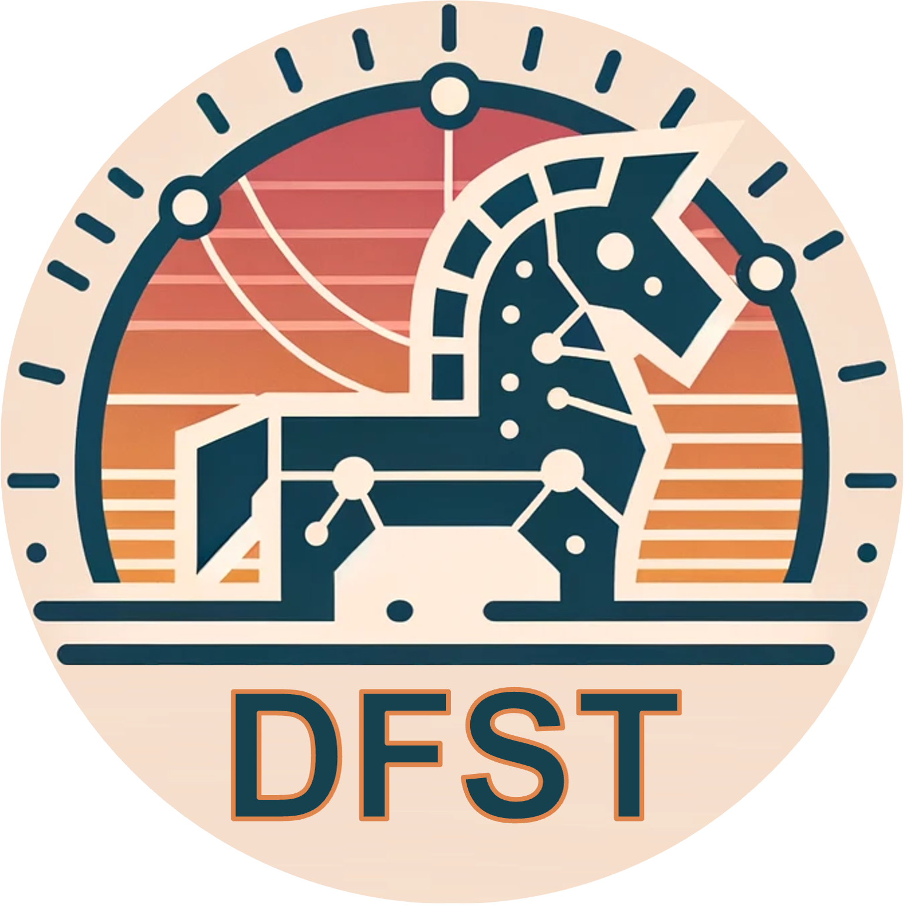
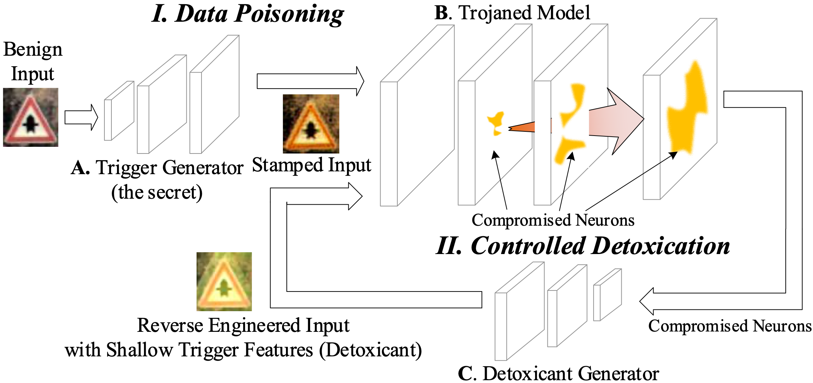

<div align="center">
    
</div>

# Deep Feature Space Trojan Attack of Neural Networks by Controlled Detoxification


Table of Contents
=================
- [Table of Contents](#table-of-contents)
  - [Overview](#overview)
  - [Code Architecutre](#code-architecture)
  - [Environments](#environments)
  - [Requirement](#requirement)
  - [Experiments](#experiments)
    - [Usage](#usage)
    - [Configurations](#configurations)
    - [Outputs](#outputs)
    - [Revisions to the Original](#revisions-to-the-original)
  - [Citation](#citation)
  - [Acknowledgement](#acknowledgement)

## Overview
- This is the PyTorch implementation for AAAI 2021 paper "[Deep Feature Space Trojan Attack of Neural Networks by Controlled Detoxification](https://ojs.aaai.org/index.php/AAAI/article/view/16201/16008)".
- The original TensorFlow version is available in the "**tensorflow**" branch of this repository.
- [[arXiv](https://arxiv.org/abs/2012.11212)\] | \[[video](https://slideslive.com/38948448/deep-feature-space-trojan-attack-of-neural-networks-by-controlled-detoxification)\] | \[[slides](https://www.cs.purdue.edu/homes/cheng535/)\] | \[[poster](https://www.cs.purdue.edu/homes/cheng535/)\]



## Code Architecture
    .
    ├── backdoors             # Backdoor functions
    ├── configs               # Configurations
    ├── data                  # Data folder
    │   └── trigger           # Trigger images (style images)
    ├──magenta_arbitrary-image-stylization-v1-256_2  # Model path of the style model
    ├── models                # Model architectures
    │   ├── resnet.py         # ResNet models
    │   ├── vgg.py            # VGG models
    │   └── genr.py           # Trigger injection function
    ├── attack.py             # Data poisoning function
    ├── detoxification.py     # Detoxification function
    ├── main.py               # Main function
    ├── train.py              # Training function
    └── utils.py              # Utility functions

## Environments
```bash
# Create python environment (optional)
conda env create -f environment.yml
source activate dfst
```

## Requirement
Please download the pre-trained model from the following link:
[Download Pre-trained Model](https://drive.google.com/file/d/1IyDegzRvNJzY4u6MxfpjgmCTKtcbJ6Yd/view?usp=sharing)

After downloading, unzip the file in the same directory. This will create a folder named `./magenta_arbitrary-image-stylization-v1-256_2` containing the pre-trained style transfer model.


## Experiments  
We provide example code snippets for CIFAR-10 and ResNet-18. These can be easily plugged in and modified in `./utils.py`, specifically within the `get_dataset(*)` and `get_model(*)` functions.

### Usage
- Train a clean model.
```bash
python main.py --gpu 0 --attack clean
```
- Train a model attacked by BadNets
```bash
python main.py --gpu 1 --attack badnet
```
- Train a model attacked by DFST
```bash
python main.py --gpu 2 --attack dfst
```

### Configurations
The specific DFST poisoning configurations can be found in `./configs/dfst.json`. The configurations for clean (`./configs/clean.json`) and BadNets (`./configs/badnet.json`) are similar.

| Hyperparameter | Default Value | Description |
|----------------|---------------|-------------|
| dataset | "cifar10" | The utilized dataset. |
| network | "resnet18" | The utilized model architecture. |
| seed | 1024 | Random seed for reproducibility. |
| batch_size | 128 | Batch size for training. |
| epochs | 200 | Total number of training epochs. |
| attack | "dfst" | Type of backdoor attack employed. |
| target | 0 | The attack target label. |
| poison_rate | 0.05 | Poisoning rate within a training batch. |
| style_model_path | "magenta_arbitrary-image-stylization-v1-256_2" | Path to the pre-trained style model. |
| alpha | 0.6 | Transparency parameter for poisoned images. |
| detox_flag | true | Indicates whether the detoxification process is applied. |
| detox_layers | ["layer4"] | The selected layers for detoxfication. |
| detox_neuron_ratio | 0.01 | Ratio of compromised neurons identified in each layer. |
| detox_epochs | 10 | Number of epochs for training the feature injector. |
| w_ssim | 0.1 | Weight of the SSIM loss during feature injector training. |
| w_detox | 0.3 | Weight of the detoxing loss during feature injector training. |

### Outputs
A saved model path will be appended to the folder upon training completion. For example, after training a DFST-attacked model, the folder `./model_dir_dfst` will be created. This folder will contain various data and logs.
- `./model_dir_dfst/model.pt`: Model file.
- `./model_dir_dfst/poison_data.pt`: Contains both training and testing poisoned data.
- `./model_dir_dfst/training.log`: Logs of the training process.
- `./model_dir_dfst/visual_poison.png`: Visualization of a few poisoned images.

### Revisions to the Original
- Replaced CycleGAN training with a pre-trained [Arbitrary-Image-Stylization](https://tfhub.dev/google/magenta/arbitrary-image-stylization-v1-256/2) model for efficiency (`./backdoors/dfst.py`).
- Dynamically adjusted intensity of style transfer using the transparency parameter (`alpha`).
- Switched to a simplified *Feature Injection* function (`./models/genr.py`) over UNet to accelerate convergence.
- Identified the top-ranked (1%) compromised neurons (`./detoxification.py`), moving away from the use of multiple thresholds.
- Implemented the *Detoxification* process during each training epoch (`./train.py`).


## Citation
Please cite our paper if you find it useful for your research.😀

```bibtex
@inproceedings{cheng2021deep,
  title={Deep feature space trojan attack of neural networks by controlled detoxification},
  author={Cheng, Siyuan and Liu, Yingqi and Ma, Shiqing and Zhang, Xiangyu},
  booktitle={Proceedings of the AAAI Conference on Artificial Intelligence},
  volume={35},
  number={2},
  pages={1148--1156},
  year={2021}
}
```

## Acknowledgement
- [(Google) Arbirtary Image Stylization](https://tfhub.dev/google/magenta/arbitrary-image-stylization-v1-256/2)
- [BackdoorVault](https://github.com/Gwinhen/BackdoorVault)
- [FLIP](https://github.com/KaiyuanZh/FLIP)
